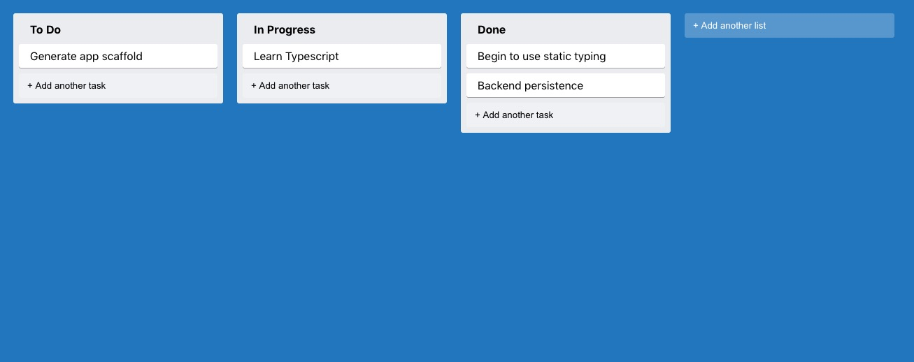

## Trello Clone

Based on https://www.newline.co/fullstack-react-with-typescript by Maksim Ivanov & Alex Bespoyasov

Features:

- TypeScript & React (via create-react-app)
- styled-components
- react-dnd (only for Desktop. To enable mobile drag-and-drop functionality, add Touch Backend https://react-dnd.github.io/react-dnd/docs/backends/touch)
- simple Express backend

In the project directory, you can run:

### `yarn start`

Runs the app in development mode, kicking off the backend service on localhost:4000
Open [http://localhost:3000](http://localhost:3000) to view it in the browser.

